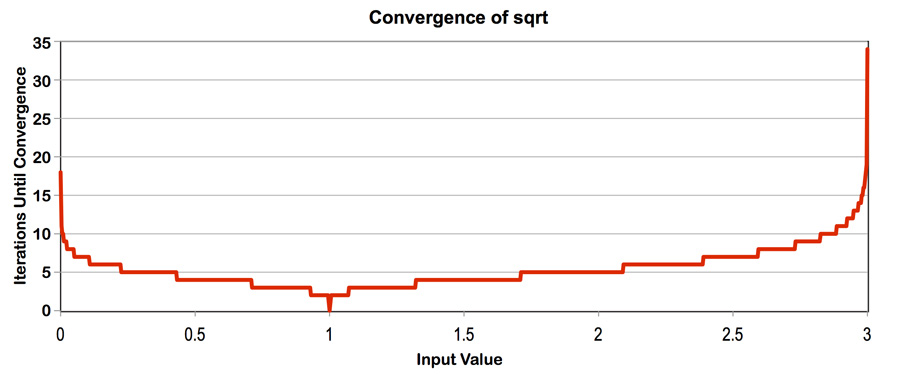
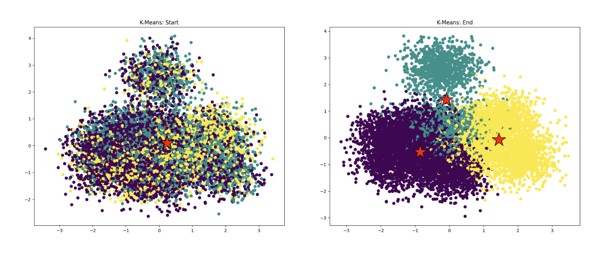

# 作业 1：四核 CPU 上的性能分析（中文翻译版）#

> 本文档是 `README.md` 的中文翻译，供阅读参考。一切以英文原版为准。

**截止日期：10 月 6 日（周一）晚 11:59**

**总分 100 分 + 6 分附加分**

## 概述 ##

本作业旨在帮助你理解现代多核 CPU 中两种主要的并行执行形式：

1. 单个处理核心内部的 SIMD 执行
2. 使用多个核心的并行执行（你还会看到 Intel 超线程 Hyper-threading 的效果）

你还将获得测量和分析并行程序性能的经验（这是一项有挑战但非常重要的技能，整门课都会用到）。本作业涉及的编程量很小，但分析量很大！

## 环境搭建 ##

__本作业需要在新的 myth 机器上运行代码__
（这些机器的主机名是 `myth[51-66].stanford.edu`）。如果你在 myth 机器上没有家目录，请在[这里](https://stanford.service-now.com/it_services?id=sc_cat_item&sys_id=cab169801bd918d0685d4377cc4bcbe0)提交 HelpSU 工单。

这些机器配备 4 核 4.2 GHz Intel Core i7 处理器（动态频率调节可以在芯片认为有用且可行时把它提到 4.5 GHz）。每个核心支持__两个硬件线程__（Intel 称之为"超线程"），并且核心可以执行 AVX2 向量指令，即对 8 个单精度浮点数组成的向量同时执行相同的__八路 SIMD 操作__。好奇的同学可以查看该 CPU 的完整规格：
<https://www.intel.com/content/www/us/en/products/sku/97129/intel-core-i77700k-processor-8m-cache-up-to-4-50-ghz/specifications.html>。想深入了解的同学可能会喜欢[这篇关于 Kaby Lake 微架构的文章](https://en.wikichip.org/wiki/intel/microarchitectures/kaby_lake)。

注意：出于评分目的，我们期望你报告在 Stanford myth 机器上运行的性能数据。不过出于兴趣，你也可以在自己的机器上运行本作业的程序（你需要先安装 Intel SPMD Program Compiler (ISPC)，下载地址：<http://ispc.github.io/>）。如果你把在其他机器上的运行结果也写进报告，请一定要写清楚是在哪台机器上跑的。

开始前的准备工作：

1. 编译本作业中的许多程序需要 ISPC。在 myth 机器上可以按以下步骤轻松安装 ISPC：

在 myth 机器上，把 Linux 二进制包下载到你选择的本地目录。你可以从 ISPC [下载页面](https://ispc.github.io/downloads.html)获取 Linux 版编译器二进制文件。在 `myth` 上，我们建议用 `wget` 直接从下载页下载。截至 2025 年秋季第 1 周，下面的 `wget` 命令可用：

    wget https://github.com/ispc/ispc/releases/download/v1.28.1/ispc-v1.28.1-linux.tar.gz

解压下载的文件：`tar -xvf ispc-v1.28.1-linux.tar.gz`

把 ISPC 的 `bin` 目录加入你的系统路径。例如，如果解压后得到目录 `~/Downloads/ispc-v1.28.1-linux`，在 bash 中这样更新 PATH：

    export PATH=$PATH:${HOME}/Downloads/ispc-v1.28.1-linux/bin

可以把上面这行加入你的 `.bashrc` 文件使其永久生效。

如果你使用 csh，需要用 `setenv` 来更新 `PATH`，自行 Google 一下即可。

2. 作业初始代码在 <https://github.com/stanford-cs149/asst1>。请用以下命令克隆作业 1 的初始代码：

    `git clone https://github.com/stanford-cs149/asst1.git`

## 程序 1：用多线程并行生成分形图（20 分）##

编译并运行代码库中 `prog1_mandelbrot_threads/` 目录下的代码
（输入 `make` 编译，`./mandelbrot` 运行）。
该程序会生成图像文件 `mandelbrot-serial.ppm`，它是著名复数集合——Mandelbrot 集的可视化。大多数平台都有 .ppm 查看器。如果想远程查看生成的图像，首先确保你有 _X server_。Linux 系统无需下载任何软件；Mac 可以用 [Xquartz](https://www.xquartz.org/)，Windows 可以用 [VcXsrv](https://sourceforge.net/projects/vcxsrv/)。
有了 SSH X-Forwarding 支持后，确保用 `ssh -Y` 登录 myth 机器，
然后就可以用 `display` 命令查看图像。正如下图所示，
结果是一个熟悉而美丽的分形。图像中每个像素
对应复平面上的一个值，像素的亮度正比于判断
该值是否属于 Mandelbrot 集所需的计算代价。要得到第 2 个视图，
使用命令行选项 `--view 2`（参见 `mandelbrotSerial.cpp` 中定义的
`mandelbrotSerial()` 函数）。你可以在
<http://en.wikipedia.org/wiki/Mandelbrot_set> 了解更多 Mandelbrot 集的定义。

你的任务是使用 [std::thread](https://en.cppreference.com/w/cpp/thread/thread) 并行化图像计算。`mandelbrotThread.cpp` 中的 `mandelbrotThread()` 函数里提供了会额外创建一个线程的初始代码。在这个函数中，主应用线程用构造函数 `std::thread(function, args...)` 创建了另一个线程，并通过对线程对象调用 `join` 等待其完成。
目前被启动的线程不做任何计算，直接返回。
你应该在 `workerThreadStart` 函数中添加代码来完成这个任务。
本作业中你不需要使用任何其他的 std::thread API。

**你需要做的：**

1. 修改初始代码，用两个处理器并行化 Mandelbrot 图像生成。具体来说，线程 0 计算图像上半部分，线程 1 计算下半部分。这类问题分解方式称为_空间分解_（spatial decomposition），因为不同的处理器计算图像的不同空间区域。
2. 扩展你的代码以使用 2、3、4、5、6、7、8 个线程，相应地划分图像生成工作（线程应分得图像的若干块）。注意该处理器只有四个核心，但每个核心支持两个超线程，因此它可以在执行上下文上交错执行总共八个线程。在报告中，针对__视图 1__ 画出__相对参考串行实现的加速比__随线程数变化的图。加速比随线程数线性增长吗？在报告中给出你的假设解释为什么会（或不会）。（你可能也想画一张视图 2 的图来帮助你想出好答案。提示：仔细看看三线程那个数据点。）
3. 为了证实（或推翻）你的假设，在 `workerThreadStart()` 的开头和结尾插入计时代码，测量每个线程完成其工作所需的时间。你的测量结果如何解释你之前画出的加速比曲线？
4. 修改工作到线程的映射方式，使 Mandelbrot 集的__两个视图__加速比都提升到__大约 7-8 倍__（超过 7x 就可以，不用太纠结）。你的方案中不允许使用任何线程间同步。我们期望你想出一个对所有线程数都有效的单一工作分解策略——不允许针对每种配置硬编码特定方案！（提示：有一个非常简单的静态分配方法可以达到这个目标，且线程间不需要任何通信/同步。）在报告中描述你的并行化方法，并报告最终获得的 8 线程加速比。
5. 现在用 16 个线程运行你改进后的代码。性能比 8 线程时有明显提升吗？为什么？

## 程序 2：用 SIMD Intrinsics 向量化代码（20 分）##

看一下作业代码库 `prog2_vecintrin/main.cpp` 中的 `clampedExpSerial` 函数。`clampedExp()` 函数对输入数组的所有元素计算 `values[i]` 的 `exponents[i]` 次幂，并把结果钳制（clamp）在 9.999999。在程序 2 中，你的任务是向量化这段代码，使其能在有 SIMD 向量指令的机器上运行。

不过，我们不要求你用映射到现代 CPU 真实 SIMD 向量指令的 SSE 或 AVX2 intrinsics 来实现。为了简单一些，我们要求你用 `CS149intrin.h` 中定义的 CS149"假向量 intrinsics"来实现。`CS149intrin.h` 库为你提供了一组对向量值和/或向量掩码（mask）进行操作的向量指令。（这些函数并不会翻译成真实的 CPU 向量指令，而是由我们的库模拟这些操作，并提供便于调试的反馈。）`main.cpp` 中给出了一个使用 CS149 intrinsics 的向量化 `abs()` 函数示例。这个示例包含了一些基本的向量加载、存储和掩码寄存器操作。注意 `abs()` 示例只是个简单示例，实际上代码并不能正确处理所有输入！（留给你自己想为什么！）你可以通读 `CS149intrin.h` 中的所有注释和函数定义，了解有哪些操作可用。

以下是帮助你实现的一些提示：

- 每条向量指令都带有一个可选的掩码参数。掩码定义了哪些通道（lane）的输出被"屏蔽"。掩码中的 0 表示该通道被屏蔽，其值不会被该向量操作的结果覆盖。如果操作时未指定掩码，则没有通道被屏蔽（注意这等价于提供全 1 掩码）。
   *提示：* 你的方案需要使用多个掩码寄存器以及库提供的各种掩码操作。
- *提示：* `_cs149_cntbits` 函数在这个问题中很有用。
- 想想如果循环总迭代次数不是 SIMD 向量宽度的整数倍会发生什么。建议用 `./myexp -s 3` 测试你的代码。*提示：* 你可能会发现 `_cs149_init_ones` 很有用。
- *提示：* 用 `./myexp -l` 在结束时打印已执行向量指令的日志。
用 `addUserLog()` 函数在日志中加入自定义调试信息。可以随意添加额外的 `CS149Logger.printLog()` 来帮助调试。

程序的输出会告诉你实现是否生成了正确的结果。如果有错误结果，程序会打印它找到的第一个错误，并打印函数输入输出的对照表。你的函数输出在 "output = " 之后，应该和 "gold = " 之后的结果一致。程序还会打印一组统计数据，描述 CS149 假向量单元的利用率。你应当把 "Total Vector Instructions" 的值当作你实现的性能指标。（可以假设每条 CS149 假向量指令在 CS149 假 SIMD CPU 上花一个周期。）"Vector Utilization" 显示被启用的向量通道的百分比。

**你需要做的：**

1. 在 `clampedExpVector` 中实现 `clampedExpSerial` 的向量化版本。你的实现应当对任意输入数组大小（`N`）和向量宽度（`VECTOR_WIDTH`）的组合都能正确工作。
2. 运行 `./myexp -s 10000`，把向量宽度从 2、4、8 扫到 16，记录得到的向量利用率。你可以通过修改 `CS149intrin.h` 中的 `#define VECTOR_WIDTH` 值来改变向量宽度。向量利用率随 `VECTOR_WIDTH` 变化是上升、下降还是不变？为什么？
3. _附加分（1 分）：_ 在 `arraySumVector` 中实现 `arraySumSerial` 的向量化版本。你的实现可以假设 `VECTOR_WIDTH` 是输入数组大小 `N` 的因子。串行实现的时间复杂度是 `O(N)`，你的实现应当争取达到 `(N / VECTOR_WIDTH + VECTOR_WIDTH)` 甚至 `(N / VECTOR_WIDTH + log2(VECTOR_WIDTH))` 的运行时间。`hadd` 和 `interleave` 操作可能会很有用。

## 程序 3：用 ISPC 并行生成分形图（20 分）##

现在你已经熟悉了 SIMD 执行，我们回到并行 Mandelbrot 分形生成（类似程序 1）。和程序 1 一样，程序 3 计算 Mandelbrot 分形图像，但它通过同时利用 CPU 的四个核心和每个核心内的 SIMD 执行单元来获得更大的加速。

在程序 1 中，你通过为系统中每个处理核心创建一个线程来并行化图像生成，然后把部分计算分配给这些并发执行的线程。（由于程序 1 中线程与处理核心一一对应，你实际上是把工作显式分配给了各个核心。）程序 3 不再指定计算到并发线程的具体映射，而是使用 ISPC 语言结构来描述*独立的计算*。这些计算可以并行执行而不破坏程序正确性（事实上它们确实会并行执行！）。对于 Mandelbrot 图像来说，计算每个像素就是一个独立的计算。有了这些信息，ISPC 编译器和运行时系统就负责生成一个尽可能高效利用 CPU 全部并行执行资源的程序。

你需要对程序 3 做一个简单的修复，它由 C++ 和 ISPC 混合编写（这个错误导致的是性能问题，不是正确性问题）。修复正确后，你应该能观察到比 `mandelbrotSerial()` 的原始串行 Mandelbrot 实现快 32 倍以上的性能。

### 程序 3 第 1 部分：ISPC 基础（20 分中的 10 分）###

阅读 ISPC 代码时你必须记住：虽然代码看起来很像 C/C++，但 ISPC 的执行模型与标准 C/C++ 不同。与 C 不同，一个 ISPC 程序的多个程序实例（program instance）总是并行地在 CPU 的 SIMD 执行单元上执行。同时执行的程序实例数量由编译器决定（专门为底层机器选择）。这个并发实例数可以通过内置变量 `programCount` 获得。ISPC 代码可以通过内置变量 `programIndex` 引用自己的程序实例编号。因此，从 C 代码调用一个 ISPC 函数可以看作启动一组并发的 ISPC 程序实例（ISPC 文档称之为一个 gang）。这组实例运行到结束，然后控制返回到调用它的 C 代码。

__停。这是你友好的任课老师。请把上面这一段再读一遍。相信我。__

举个例子，下面的程序用普通 C 代码和 ISPC 代码组合来对两个 1024 元素向量求和。正如我们在课堂上讨论的，由于 gang 中每个实例相互独立且执行完全相同的程序逻辑，执行可以用 SIMD 指令实现来加速。

一个简单的 ISPC 程序如下。下面的 C 代码将调用下面的 ISPC 代码：

    ------------------------------------------------------------------------
    C 程序代码: myprogram.cpp
    ------------------------------------------------------------------------
    const int TOTAL_VALUES = 1024;
    float a[TOTAL_VALUES];
    float b[TOTAL_VALUES];
    float c[TOTAL_VALUES]
 
    // 在这里初始化数组 a 和 b
     
    sum(TOTAL_VALUES, a, b, c);
 
    // sum 返回后，a + b 的结果存在 c 中。

对应的 ISPC 代码：

    ------------------------------------------------------------------------
    ISPC 代码: myprogram.ispc
    ------------------------------------------------------------------------
    export sum(uniform int N, uniform float* a, uniform float* b, uniform float* c)
    {
      // 假设 programCount 整除 N。
      for (int i=0; i<N; i+=programCount)
      {
        c[programIndex + i] = a[programIndex + i] + b[programIndex + i];
      }
    }

上面的 ISPC 程序把数组元素的处理交错分配给各个程序实例。注意它与程序 1 的相似性——程序 1 中你把图像的各个部分静态分配给线程。

然而，比起思考如何在程序实例之间划分工作（即工作如何映射到执行单元），往往更方便、更强大的做法是只关注把问题划分成独立的部分。ISPC 的 `foreach` 结构提供了表达问题分解的机制。下面 ISPC 函数 `sum2` 中的 `foreach` 循环定义了一个迭代空间，其中所有迭代都是独立的，因此可以以任意顺序执行。ISPC 负责把循环迭代分配给并发的程序实例。下面 `sum` 和 `sum2` 的区别很微妙，但非常重要。`sum` 是命令式的：它描述了如何把
工作映射到并发实例。下面的例子是声明式的：它只指定要执行的工作集合。

    -------------------------------------------------------------------------
    ISPC 代码:
    -------------------------------------------------------------------------
    export sum2(uniform int N, uniform float* a, uniform float* b, uniform float* c)
    {
      foreach (i = 0 ... N)
      {
        c[i] = a[i] + b[i];
      }
    }

在继续之前，建议你阅读 <http://ispc.github.io/example.html> 上的 ISPC 教程来熟悉 ISPC 语言结构。教程中的示例程序几乎和程序 3 在 `mandelbrot.ispc` 中的 `mandelbrot_ispc()` 实现一模一样。在作业代码中，我们修改了 foreach 循环的边界，使实现更直接。

**你需要做的：**

1. 编译并运行 mandelbrot ispc 程序。__ISPC 编译器当前配置为生成 8 路 AVX2 向量指令。__ 根据你对这些 CPU 的了解，你期望的最大加速比是多少？
   为什么你观察到的数字可能低于这个理想值？（提示：想想你正在执行的计算有什么特征？图像的哪些部分对 SIMD 执行构成挑战？比较渲染 Mandelbrot 集不同视图的性能可能有助于验证你的假设。）

   提醒一下：本小节描述的代码中，ISPC 编译器把程序实例的 gang 映射到单个核心上执行的 SIMD 指令。这种并行化方式与程序 1 不同——程序 1 的加速是通过在多个核心上运行线程实现的。

如果你查阅 myth 机器 CPU 的详细技术资料，会发现每个时钟周期可以运行多少条标量和向量指令有一套复杂的规则。就本作业而言，你可以假设 8 路向量执行单元的数量和浮点运算的标量执行单元数量大致相同。

### 程序 3 第 2 部分：ISPC 任务（20 分中的 10 分）###

ISPC 的 SPMD 执行模型和 `foreach` 等机制便于创建利用 SIMD 处理的程序。该语言还提供了另一种在 ISPC 计算中利用多核的机制：启动 _ISPC 任务_（task）。

请看 `mandelbrot_ispc_withtasks` 函数中的 `launch[2]` 命令。这个命令启动两个任务。每个任务定义一个将由 ISPC 程序实例 gang 执行的计算。正如 `mandelbrot_ispc_task` 函数所示，每个任务计算最终图像的一个区域。类似于 `foreach` 结构定义可以以任意顺序（以及由 ISPC 程序实例并行）执行的循环迭代，`launch` 操作创建的任务也可以以任意顺序（以及在不同 CPU 核心上并行）处理。

**你需要做的：**

1. 带 `--tasks` 参数运行 `mandelbrot_ispc`。在视图 1 上你观察到的加速比是多少？相对不把计算划分成任务的 `mandelbrot_ispc` 版本，加速比是多少？
2. 有一个简单的方法可以提升 `mandelbrot_ispc --tasks` 的性能：改变代码创建的任务数量。只修改 `mandelbrot_ispc_withtasks()` 函数中的代码，你应该能达到比串行版本快 32 倍以上的性能！你是怎么确定要创建多少个任务的？为什么你选的数量效果最好？
3. _附加分（2 分）：_ 线程抽象（程序 1 使用的）和 ISPC 任务抽象之间有什么区别？（create/join）和（launch/sync）机制在语义上有一些明显的区别，但这些区别的含义更加微妙。这里有一个引导你回答的思想实验：如果你启动 10,000 个 ISPC 任务会发生什么？如果你启动 10,000 个线程会发生什么？（这个思想实验请讨论一般情况——即不要把你讨论绑定到这个给定的 mandelbrot 程序上。）

_聪明学生的问题：_ 等一下！为什么有两种不同的机制（`foreach` 和 `launch`）来表达独立的、可并行化的工作？系统难道不能直接把 `foreach` 的大量迭代划分到所有核心上，同时为各核心生成合适的 SIMD 代码吗？

_回答：_ 好问题！有很多可能的答案。来 office hours 讨论吧。

## 程序 4：迭代法求 `sqrt`（15 分）##

程序 4 是一个 ISPC 程序，它计算 2000 万个 0 到 3 之间随机数的平方根。它使用一种快速的迭代实现，用牛顿法求解方程 ${\frac{1}{x^2}} - S = 0$。这个实现用 1.0 作为初始猜测值。下图展示了 `sqrt` 对 (0-3) 范围内的值收敛到精确解所需的迭代次数。（该实现对超出此范围的输入不收敛）。注意收敛速度取决于初始猜测值的精度。

注意：这道题是一次复习，用来再次确认你的理解，它涵盖的概念与程序 2 和 3 类似。

**你需要做的：**

1. 编译并运行 `sqrt`。报告 ISPC 实现在单 CPU 核心（无任务）和使用所有核心（有任务）时的加速比。SIMD 并行化带来的加速比是多少？多核并行化带来的加速比是多少？
2. 修改 values 数组的内容来提升 ISPC 实现的相对加速比。构造一个特定的输入，使其相对串行版本代码的__加速比最大化__，并报告由此获得的加速比（ISPC 有任务和无任务两个实现都要）。你的修改是否提升了 SIMD 加速比？是否提升了多核加速比（即从 ISPC 无任务到有任务的收益）？请解释原因。
3. 构造一个使 ISPC（无任务）相对串行版本__加速比最小化__的特定输入。描述这个输入、你为什么这样选，并报告 ISPC 实现的相对性能。效率损失的原因是什么？
   __（请记住我们 ISPC 使用的是 `--target=avx2` 选项，生成 8 路 SIMD 指令）__。
4. _附加分（最高 2 分）：_ 用 AVX2 intrinsics 手写你自己的 `sqrt` 函数版本。要拿到分数，你的实现应当几乎和 ISPC 生成的二进制一样快（或更快）。你可能会发现 [Intel Intrinsics Guide](https://software.intel.com/sites/landingpage/IntrinsicsGuide/) 很有帮助。

## 程序 5：BLAS `saxpy`（10 分）##

程序 5 实现了 BLAS（Basic Linear Algebra Subproblems，基础线性代数子程序）库中的 saxpy 例程，这个库在许多系统上被广泛使用（并被重度优化）。`saxpy` 计算简单的操作 `result = scale*X+Y`，其中 `X`、`Y` 和 `result` 是 `N` 个元素的向量（程序 5 中 `N` = 2000 万），`scale` 是标量。注意 `saxpy` 每用到三个元素只执行两次数学运算（一次乘法、一次加法）。`saxpy` 是一个*平凡可并行的计算*，数据访问可预测、规则，执行代价也可预测。

**你需要做的：**

1. 编译并运行 `saxpy`。程序会报告 saxpy 的 ISPC（无任务）和 ISPC（有任务）实现的性能。你观察到使用 ISPC 任务带来的加速比是多少？解释这个程序的性能。你认为它还能大幅提升吗？（例如，你能重写代码达到接近线性的加速比吗？能还是不能？请论证你的答案。）
2. __附加分：__（1 分）注意 `main.cpp` 中计算消耗的总内存带宽是 `TOTAL_BYTES = 4 * N * sizeof(float);`。尽管 `saxpy` 只是从 X 加载一个元素、从 Y 加载一个元素、向 `result` 写入一个元素，乘数 4 却是正确的。为什么？（提示：想想 CPU 缓存是怎么工作的。）
3. __附加分：__（分数视具体情况而定）提升 `saxpy` 的性能。我们要的是显著的加速，不只是几个百分点。如果成功了，描述你是怎么做的，以及这些系统上最优实现可能达到什么水平。另外，如果成功了，来告诉课程组，我们会很感兴趣的。;-)

注：过去有些学生在在道题上卡住了（想得太复杂）。我们期望一个简单的答案，但跑这道题的结果可能会在你脑中引出更多问题。欢迎来和课程组讨论。

## 程序 6：让 `K-Means` 更快（15 分）##

程序 6 用 K-Means 数据聚类算法（[Wikipedia](https://en.wikipedia.org/wiki/K-means_clustering)、[CS 221 讲义](https://stanford.edu/~cpiech/cs221/handouts/kmeans.html)）对一百万个数据点进行聚类。如果你不熟悉这个算法，别担心！算法的细节对这个练习并不重要。大致来说：给定 K 个起始点（聚类质心），算法迭代地更新质心，直到满足收敛条件。结果可以从下面的图中看到，图中展示了程序开始和结束时算法的状态，红色星号是聚类质心，数据点的颜色对应其聚类分配。

在初始代码中，你已经得到了一个正确的 K-Means 算法实现，但它当前的状态没有我们希望的那么快。这就是你的用武之地！你的任务是弄清楚实现需要在__哪里__改进以及__如何__改进。本题练习的关键技能是__定位性能热点__。我们不会告诉你该看哪里，你需要自己找出来。你的第一个念头应该是……代码把时间花在哪里了？然后往源码里插入计时代码来做测量。基于这些测量，你应该聚焦到占用大量运行时间的那部分代码，然后更仔细地理解它，判断是否有办法加速。

**你需要做的：**

1. 用命令 `ln -s /afs/ir.stanford.edu/class/cs149/data/data.dat ./data.dat` 在当前目录创建一个指向数据集的符号链接（确保你在 `prog6_kmeans` 目录下）。这是个大文件（约 800MB），所以这是访问它的首选方式。不过，如果你想在本地有一份拷贝，可以在你自己的机器上运行 `scp [你的 SUNetID]@myth[51-66].stanford.edu:/afs/ir.stanford.edu/class/cs149/data/data.dat ./data.dat`。拿到数据后，编译并运行 `kmeans`（第一次运行时程序加载数据可能比平时慢）。程序会报告算法在该数据上的总运行时间。
2. 运行 `pip install -r requirements.txt` 下载必要的绘图包。然后试着运行 `python3 plot.py`，它会根据运行 `kmeans` 生成的日志（"start.log" 和 "end.log"）生成文件 "start.png" 和 "end.png"。这些文件会在当前目录下，看起来应该和上面的图类似。__警告：你可能会注意到并非所有点都被分配到了"最近"的质心。这是正常的。__（想了解原因的同学：我们用 [PCA](https://en.wikipedia.org/wiki/Principal_component_analysis) 把 100 维数据点投影到 2 维来做可视化。因此，虽然 100 维数据点在高维空间中靠近合适的质心，但数据点和质心的投影可能彼此并不接近。）只要聚类看起来"合理"（以第 2 步初始代码生成的图像为参照），且大多数点看起来被分配到了最近的质心，代码就仍然是正确的。
3. 利用 `common/CycleTimer.h` 中的计时函数确定代码中的性能瓶颈在哪里。你需要调用 `CycleTimer::currentSeconds()`，它以浮点数返回当前时间（秒）。代码的大部分时间花在哪里？
4. 基于上一步的发现改进实现。我们期望大约 2.1 倍或以上的加速比（即 $\frac{旧运行时间}{新运行时间} \geq 2.1$）。请解释你是如何得出你的方案的，以及你的最终方案是什么、相应的加速比是多少。这部分的报告应当描述一系列步骤，形式类似"我测量了……这让我相信 X。所以为了改进，我尝试了……结果加速/减速了……"。

约束条件：
- 你只能修改 `kmeansThread.cpp` 中的代码。不允许修改 `stoppingConditionMet` 函数，也不能改变 `kMeansThread` 的接口，但除此之外都可以（例如，你可以给 `WorkerArgs` 结构体添加新成员、重写函数、分配新数组等等）。不过……
- **确保你没有改变实现的功能！如果算法不收敛了，或者 `python3 plot.py` 的结果和初始代码生成的不一样，那就说明出问题了！** 例如，你不能简单地删掉主 "while" 循环或改变 `dist` 函数的语义，因为这会产生错误的结果。
- __重要：__ 你只能并行化以下函数之__一__：`dist`、`computeAssignments`、`computeCentroids`、`computeCost`。如何用 `std::thread` 写并行代码的示例见 `prog1_mandelbrot_threads/mandelbrotThread.cpp`。

提示 / 注：
- 这道题不需要大量的编程。我们的解法修改/增加了大约 20-25 行代码。
- 一旦你用计时器定位了热点，为了改进代码，请确保你理解 K、M 和 N 的相对大小。
- 优先考虑有高回报潜力的代码改进，并思考这个问题中可用的不同并行维度以及如何利用它们。
- **这道题的目的是让你多练习如何分析和调试面向性能的程序。即使你没有达到性能目标，只要在报告中展示出良好/深思熟虑的调试技巧，你仍然能拿到大部分分数。**

## ARM 版 Mac 怎么办？ ##

如果你有新的 Apple ARM 架构笔记本，查看[这里](README_aarch64.md)的讲义，在新 Apple ARM 笔记本上跑各个程序并写一份性能报告。课程组很好奇你会发现什么：SIMD 执行带来的加速比是多少？没有现代 Macbook 的同学可以尝试用 AWS 等云厂商提供的 ARM 服务器，不过课程组没有测试过。请不要把在 ARM 机器上运行的任何代码提交到 Gradescope。

## 给好奇的同学（强烈推荐）##

想知道 ISPC 是怎么被创造出来的吗？ISPC 的两位作者之一 Matt Pharr 写过一篇__极好的博客文章__，讲述其开发历史：[The story of ispc](https://pharr.org/matt/blog/2018/04/30/ispc-all)。它触及了并行系统设计的许多问题——特别是限定作用域的编程语言 vs 通用编程语言的价值，还给出了"为什么编译器不能自动帮我并行化程序？"这类问题的真实答案。在我看来这是 CS149 学生的必读文章！

## 提交说明 ##

通过 [Gradescope](https://www.gradescope.com) 提交。每组只需提交一份，但请确保在 Gradescope 提交中添加你搭档的名字。你需要在 Gradescope 上的两个地方提交文件：`Assignment 1 (Write-Up)` 和 `Assignment 1 (Code)`。

请在 `Assignment 1 (Write-Up)` 中提交：
* 你的报告，文件名为 `writeup.pdf`。请确保两位组员的姓名和 SUNet id 都在文档中（如果你们是两人一组）。

请在 `Assignment 1 (Code)` 中提交：
* 你在程序 2 中的 `main.cpp` 实现，文件名为 `prob2.cpp`
* 你在程序 6 中的 `kmeansThread.cpp` 实现，文件名为 `prob6.cpp`
* 任何额外的代码，例如你尝试了附加分

请在报告中告诉助教去哪里找你的附加分。提交时，所有代码必须能在 myth 机器上直接编译运行！

## 资源和注记 ##

- 详尽的 ISPC 文档和示例见 <http://ispc.github.io/>
- 放大 Mandelbrot 图像的不同位置可能非常有趣
- Intel 在 <http://software.intel.com/en-us/avx/> 提供了很多关于 AVX2 向量指令的辅助材料
- [Intel Intrinsics Guide](https://software.intel.com/sites/landingpage/IntrinsicsGuide/) 非常好用
