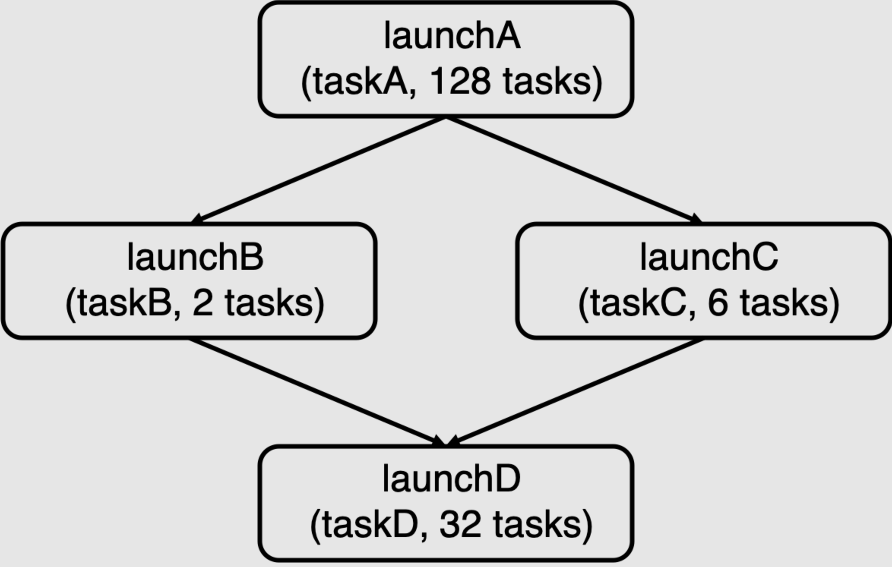

> 本文档是 README.md 的中文翻译，仅供学习参考，以英文原版为准。

# 作业 2：从零构建一个任务执行库 #

**截止日期：10 月 16 日（周四）晚上 11:59**

**总分 100 分**

## 概述（Overview） ##

每个人都希望快速完成任务，在本次作业中，我们要求你做的正是这件事！你将实现一个 C++ 库，在多核 CPU 上尽可能高效地执行应用程序提供的任务（task）。

在作业的第一部分，你将实现一个支持批量（数据并行）启动同一任务的多个实例的任务执行库版本。这一功能类似于你在作业 1 中用来跨核并行化代码的 [ISPC 任务启动行为](http://ispc.github.io/ispc.html#task-parallelism-launch-and-sync-statements)。

在作业的第二部分，你将扩展你的任务运行时系统，以执行更复杂的_任务图（task graph）_——任务的执行可能依赖于其他任务产生的结果。这些依赖关系约束了你的任务调度系统可以安全并行运行哪些任务。在并行机器上调度数据并行任务图的执行，是许多流行并行运行时系统的共同特性，从流行的 [Thread Building Blocks](https://github.com/intel/tbb) 库，到 [Apache Spark](https://spark.apache.org/)，再到现代深度学习框架如 [PyTorch](https://pytorch.org/) 和 [TensorFlow](https://www.tensorflow.org/)。

本次作业将要求你：

* 使用线程池（thread pool）管理任务执行
* 使用互斥锁（mutex）和条件变量（condition variable）等同步原语来协调工作线程的执行
* 实现一个反映任务图所定义依赖关系的任务调度器
* 理解工作负载特征，以做出高效的任务调度决策

我们建议复习我们的 [C++ 同步机制教程](tutorial/README.md)，以了解更多关于 C++ 标准库中同步原语的信息。此外，浏览一下[测试用例说明](tests/)也有助于理解你的库需要支持的工作负载类型。

### 等等，我是不是以前做过这个？ ###

你可能已经在 CS107 或 CS111 等课程中创建过线程池和任务执行库。
然而，本次作业是一个深入理解这些系统的独特机会。
你将实现多个任务执行库，其中一些不使用线程池，另一些使用不同类型的线程池。
通过实现多种任务调度策略并比较它们在不同工作负载上的性能，你将更好地理解在创建并行系统时关键设计决策的影响。

## 环境搭建（Environment Setup） ##

**我们将在 Amazon AWS `c7g.4xlarge` 实例上对本作业进行评分——我们在[这里](https://github.com/stanford-cs149/asst2/blob/master/cloud_readme.md)提供了虚拟机（VM）的搭建说明。请确保你的代码能在该 VM 上运行，因为我们将用它进行性能测试和评分。**

作业的初始代码（starter code）发布在 [Github](https://github.com/stanford-cs149/asst2) 上。请在以下地址下载作业 2 的初始代码：

    https://github.com/stanford-cs149/asst2/archive/refs/heads/master.zip

**重要：** 不要修改提供的 `Makefile`，否则可能会破坏我们的评分脚本。

## A 部分：同步批量任务启动（Synchronous Bulk Task Launch） ##

在作业 1 中，你使用了 ISPC 的任务启动原语来启动一个 ISPC 任务的 N 个实例（`launch[N] myISPCFunction()`）。在本次作业的第一部分，你将在你的任务执行库中实现类似的功能。

首先，请熟悉 `itasksys.h` 中 `ITaskSystem` 的定义。这个[抽象类](https://www.tutorialspoint.com/cplusplus/cpp_interfaces.htm)定义了你的任务执行系统的接口。该接口包含一个 `run()` 方法，其签名如下：

    virtual void run(IRunnable* runnable, int num_total_tasks) = 0;

`run()` 会执行指定任务的 `num_total_tasks` 个实例。由于这一个函数调用会导致多个任务的执行，我们将每次对 `run()` 的调用称为一次_批量任务启动（bulk task launch）_。

`tasksys.cpp` 中的初始代码包含了一个正确但串行的 `TaskSystemSerial::run()` 实现，它演示了任务系统如何使用 `IRunnable` 接口来执行批量任务启动。（`IRunnable` 的定义在 `itasksys.h` 中。）请注意，在每次调用 `IRunnable::runTask()` 时，任务系统都会向任务提供当前的任务标识符（一个介于 0 和 `num_total_tasks` 之间的整数），以及本次批量任务启动中的任务总数。任务的实现将使用这些参数来决定该任务应该做什么工作。

`run()` 的一个重要细节是：它必须相对于调用线程**同步地**执行任务。换句话说，当 `run()` 调用返回时，应用程序被保证任务系统已经完成了本次批量任务启动中****所有任务****的执行。初始代码中提供的 `run()` 串行实现在调用线程上执行所有任务，因此满足这一要求。

### 运行测试（Running Tests） ###

初始代码包含了一套使用你的任务系统的测试应用程序。关于测试框架（test harness）中各测试的说明，请参见 `tests/README.md`；测试定义本身请参见 `tests/tests.h`。要运行某个测试，请使用 `runtasks` 脚本。例如，要运行名为 `mandelbrot_chunked` 的测试——它通过批量启动多个各自处理图像中一个连续分块的任务来计算 Mandelbrot 分形图像——请输入：

```bash
./runtasks -n 16 mandelbrot_chunked
```


不同的测试具有不同的性能特征——有些每个任务只做很少的工作，有些则执行大量处理。有些测试每次启动创建大量任务，有些则只有很少任务。有时一次启动中的所有任务计算开销相近；在另一些测试中，单次批量启动内各任务的开销是可变的。我们已经在 `tests/README.md` 中描述了大部分测试，但我们鼓励你查看 `tests/tests.h` 中的代码，以更详细地了解所有测试的行为。

> [!TIP]
> 在实现你的解决方案时，有一个可能对调试正确性有帮助的测试是 `simple_test_sync`。这是一个非常小的测试，不应用于测量性能，但它足够小，可以用打印语句或调试器来调试。请参见 `tests/tests.h` 中的 `simpleTest` 函数。


我们鼓励你创建自己的测试。可以参考 `tests/tests.h` 中现有的测试来获取灵感。我们还提供了一个由 `class YourTask` 和 `yourTest()` 函数组成的骨架测试，供你在需要时基于它进行开发。对于你创建的测试，请确保将它们添加到 `tests/main.cpp` 中的测试列表和测试名称列表中，并相应地调整变量 `n_tests`。请注意，虽然你可以用自己的解决方案来运行你自己的测试，但你无法编译参考实现（reference solution）来运行你的测试。

`-n` 命令行选项指定任务系统实现可以使用的最大线程数。在上面的例子中，我们选择 `-n 16` 是因为 AWS 实例的 CPU 具有十六个执行上下文（execution context）。可通过命令行帮助（`-h` 命令行选项）查看可运行测试的完整列表。

`-i` 命令行选项指定在性能测量期间运行测试的次数。为了获得准确的性能测量，`./runtasks` 会多次运行测试并记录若干次运行中的_最小_运行时间；一般来说，默认值已经足够——更大的值可能会产生更准确的测量结果，但代价是更长的测试运行时间。

此外，我们还提供了用于评分性能的测试框架（test harness）：

```bash
>>> python3 ../tests/run_test_harness.py
```

该测试框架有以下命令行参数：

```bash
>>> python3 run_test_harness.py -h
usage: run_test_harness.py [-h] [-n NUM_THREADS]
                           [-t TEST_NAMES [TEST_NAMES ...]] [-a]

Run task system performance tests

optional arguments:
  -h, --help            show this help message and exit
  -n NUM_THREADS, --num_threads NUM_THREADS
                        Max number of threads that the task system can use. (16
                        by default)
  -t TEST_NAMES [TEST_NAMES ...], --test_names TEST_NAMES [TEST_NAMES ...]
                        List of tests to run
  -a, --run_async       Run async tests
```

它会生成一份详细的性能报告，如下所示：

```bash
>>> python3 ../tests/run_test_harness.py -t super_light super_super_light
python3 ../tests/run_test_harness.py -t super_light super_super_light
================================================================================
Running task system grading harness... (2 total tests)
  - Detected CPU with 16 execution contexts
  - Task system configured to use at most 16 threads
================================================================================
================================================================================
Executing test: super_super_light...
Reference binary: ./runtasks_ref_linux
Results for: super_super_light
                                        STUDENT   REFERENCE   PERF?
[Serial]                                9.053     9.022       1.00  (OK)
[Parallel + Always Spawn]               8.982     33.953      0.26  (OK)
[Parallel + Thread Pool + Spin]         8.942     12.095      0.74  (OK)
[Parallel + Thread Pool + Sleep]        8.97      8.849       1.01  (OK)
================================================================================
Executing test: super_light...
Reference binary: ./runtasks_ref_linux
Results for: super_light
                                        STUDENT   REFERENCE   PERF?
[Serial]                                68.525    68.03       1.01  (OK)
[Parallel + Always Spawn]               68.178    40.677      1.68  (NOT OK)
[Parallel + Thread Pool + Spin]         67.676    25.244      2.68  (NOT OK)
[Parallel + Thread Pool + Sleep]        68.464    20.588      3.33  (NOT OK)
================================================================================
Overall performance results
[Serial]                                : All passed Perf
[Parallel + Always Spawn]               : Perf did not pass all tests
[Parallel + Thread Pool + Spin]         : Perf did not pass all tests
[Parallel + Thread Pool + Sleep]        : Perf did not pass all tests
```

在上面的输出中，`PERF` 是你的实现的运行时间与参考实现运行时间的比值。因此，小于 1 的值表示你的任务系统实现比参考实现更快。

> [!TIP]
> Mac 用户：虽然我们为 A 部分和 B 部分都提供了参考实现的二进制文件，但我们将使用 Linux 二进制文件来测试你的代码。因此，我们建议你在提交之前在 AWS 实例上检查你的实现。如果你使用的是带 M1 芯片的较新 Mac，本地测试时请使用 `runtasks_ref_osx_arm` 二进制文件；否则，请使用 `runtasks_ref_osx_x86` 二进制文件。

> [!IMPORTANT]
> 我们将在 AWS 上使用参考实现的 `runtasks_ref_linux_arm` 版本对你的解决方案进行评分。请确保你的解决方案在 AWS ARM 实例上能够正确运行。

### 你需要做什么（What You Need To Do） ###

你的任务是实现一个能高效利用多核 CPU 的任务执行引擎。评分将同时基于你实现的正确性（它必须正确运行所有任务）和性能。这应该是一个有趣的编程挑战，但也是一项不平凡的工作。为了帮助你保持正确的方向，在完成 A 部分的过程中，我们将让你实现任务系统的多个版本，使实现的复杂度和性能逐步提升。你的三个实现将位于 `tasksys.cpp/.h` 中定义的类里。

* `TaskSystemParallelSpawn`
* `TaskSystemParallelThreadPoolSpinning`
* `TaskSystemParallelThreadPoolSleeping`

__请在 `part_a/` 子目录中实现你的 A 部分代码，以便与正确的参考实现（`part_a/runtasks_ref_*`）进行比较。__

_专业提示：请注意，下面的说明采用的方法是"先尝试最简单的改进"。每一步都会增加任务执行系统实现的复杂度，但在这一过程中的每一步，你都应该拥有一个可工作的（完全正确的）任务运行时系统。_

我们还要求你至少创建一个测试，可以测试正确性或性能。更多信息请参见上文的"运行测试"一节。

#### 第 1 步：转向并行任务系统 ####

__在这一步，请实现 `TaskSystemParallelSpawn` 类。__

初始代码在 `TaskSystemSerial` 中为你提供了一个可工作的串行任务系统实现。在作业的这一部分，你将扩展初始代码，使其能够并行执行批量任务启动。

* 你需要创建额外的控制线程来执行批量任务启动的工作。请注意，`TaskSystem` 的构造函数接收一个参数 `num_threads`，它是你的实现可用于运行任务的****最大工作线程数****。

* 本着"先做最简单的事"的精神，我们建议你在 `run()` 开始时派生（spawn）工作线程，并在 `run()` 返回之前从主线程汇合（join）这些线程。这会是一个正确的实现，但由于频繁创建线程，会产生显著的开销。

* 你将如何把任务分配给你的工作线程？你应该考虑任务到线程的静态分配还是动态分配？

* 是否存在需要保护的共享变量（你的任务执行系统的内部状态），以防止多个线程同时访问？

#### 第 2 步：使用线程池避免频繁创建线程 ####

__在这一步，请实现 `TaskSystemParallelThreadPoolSpinning` 类。__

你在第 1 步中的实现会因为每次调用 `run()` 都创建线程而产生开销。当任务的计算代价很小时，这种开销尤其明显。此时，我们建议你转向"线程池"实现：你的任务执行系统预先创建所有工作线程（例如，在 `TaskSystem` 构造期间，或在第一次调用 `run()` 时）。

* 作为初始实现，我们建议你将工作线程设计为持续循环，始终检查是否有更多工作可供执行。（线程进入 while 循环直到某个条件为真，通常称为"自旋（spinning）"。）工作线程如何确定有工作要做？

* 现在要确保 `run()` 实现所需的同步行为就不那么平凡了。你需要如何修改 `run()` 的实现，才能确定批量任务启动中的所有任务都已完成？

#### 第 3 步：在没有工作可做时让线程休眠 ####

__在这一步，请实现 `TaskSystemParallelThreadPoolSleeping` 类。__

第 2 步实现的缺点之一是：线程在"自旋"等待有工作可做时会占用 CPU 核的执行资源。例如，工作线程可能会循环等待新任务到达。再例如，主线程可能会循环等待工作线程完成所有任务，以便从 `run()` 调用返回。这会损害性能，因为即使这些线程没有在做有用的工作，CPU 资源仍被用于运行它们。

在作业的这一部分，我们希望你通过让线程休眠来改进任务系统的效率，直到它们等待的条件被满足。

* 你的实现可以选择使用条件变量（condition variable）来实现这一行为。条件变量是一种同步原语，它使线程能够在等待某个条件成立期间进入休眠（并且不占用任何 CPU 处理资源）。其他线程可以"唤醒（signal）"正在等待的线程，让它们检查所等待的条件是否已经满足。例如，当没有工作可做时，你的工作线程可以进入休眠（这样它们就不会从试图做有用工作的线程那里抢走 CPU 资源）。再例如，调用 `run()` 的主应用程序线程在等待工作线程完成批量任务启动中的所有任务时，可能希望进入休眠。（否则，自旋的主线程会从工作线程那里抢走 CPU 资源！）

* 你在作业这一部分的实现可能需要考虑棘手的竞态条件（race condition）。你需要考虑线程行为的许多种可能交错（interleaving）。

* 你可能需要考虑编写额外的测试用例来检验你的系统。__作业初始代码中包含了评分脚本将用来评估你代码性能的工作负载，但我们还会使用一组更广泛的、未在初始代码中提供的工作负载来测试你实现的正确性！__

## B 部分：支持任务图的执行（Supporting Execution of Task Graphs） ##

在作业的 B 部分，你将扩展 A 部分的任务系统实现，以支持可能依赖于先前任务的任务的_异步（asynchronous）_启动。这些任务间依赖产生了你的任务执行库必须遵守的调度约束。

`ITaskSystem` 接口有一个额外的方法：

    virtual TaskID runAsyncWithDeps(IRunnable* runnable, int num_total_tasks,
                                    const std::vector<TaskID>& deps) = 0;

`runAsyncWithDeps()` 与 `run()` 的相似之处在于，它也用于执行 `num_total_tasks` 个任务的批量启动。然而，它在许多方面与 `run()` 不同……

#### 异步任务启动（Asynchronous Task Launch） ####

首先，使用 `runAsyncWithDeps()` 创建的任务由任务系统与调用线程_异步地_执行。这意味着 `runAsyncWithDeps()` 应该_立即_返回给调用者，即使任务尚未完成执行。该方法返回一个与本次批量任务启动关联的唯一标识符。

调用线程可以通过调用 `sync()` 来确定批量任务启动何时真正完成。

    virtual void sync() = 0;

`sync()` __只有在与之前所有批量任务启动相关联的任务都完成后__才返回给调用者。例如，考虑以下代码：

    // assume taskA and taskB are valid instances of IRunnable...

    std::vector<TaskID> noDeps;  // empty vector

    ITaskSystem *t = new TaskSystem(num_threads);

    // bulk launch of 4 tasks
    TaskID launchA = t->runAsyncWithDeps(taskA, 4, noDeps);

    // bulk launch of 8 tasks
    TaskID launchB = t->runAsyncWithDeps(taskB, 8, noDeps);

    // at this point tasks associated with launchA and launchB
    // may still be running

    t->sync();

    // at this point all 12 tasks associated with launchA and launchB
    // are guaranteed to have terminated

如上面注释所述，在调用线程调用 `sync()` 之前，不能保证先前调用 `runAsyncWithDeps()` 所创建的任务已经完成。准确地说，`runAsyncWithDeps()` 告诉你的任务系统执行一次新的批量任务启动，但你的实现可以灵活地在下一次调用 `sync()` 之前的任意时间执行这些任务。请注意，这一规范意味着不能保证你的实现会先执行 launchA 的任务、再开始 launchB 的任务！

#### 对显式依赖的支持（Support for Explicit Dependencies） ####

`runAsyncWithDeps()` 的第二个关键细节是它的第三个参数：一个 TaskID 标识符的向量，这些标识符必须指向先前使用 `runAsyncWithDeps()` 发起的批量任务启动。该向量指定了当前批量任务启动中的任务依赖于哪些先前的任务。__因此，在依赖向量中给出的各次启动的所有任务全部完成之前，你的任务运行时不能开始执行当前批量任务启动中的任何任务！__ 例如，考虑以下示例：

    std::vector<TaskID> noDeps;  // empty vector
    std::vector<TaskID> depOnA;
    std::vector<TaskID> depOnBC;

    ITaskSystem *t = new TaskSystem(num_threads);

    TaskID launchA = t->runAsyncWithDeps(taskA, 128, noDeps);
    depOnA.push_back(launchA);

    TaskID launchB = t->runAsyncWithDeps(taskB, 2, depOnA);
    TaskID launchC = t->runAsyncWithDeps(taskC, 6, depOnA);
    depOnBC.push_back(launchB);
    depOnBC.push_back(launchC);

    TaskID launchD = t->runAsyncWithDeps(taskD, 32, depOnBC);
    t->sync();

上面的代码包含四次批量任务启动（taskA：128 个任务，taskB：2 个任务，taskC：6 个任务，taskD：32 个任务）。请注意，taskB 和 taskC 的启动依赖于 taskA。taskD 的批量启动（`launchD`）依赖于 `launchB` 和 `launchC` 两者的结果。因此，虽然你的任务运行时可以按任意顺序（包括并行地）处理与 `launchB` 和 `launchC` 相关联的任务，但这些启动的所有任务都必须在 `launchA` 的任务完成之后才能开始执行，并且它们必须在你的运行时可以开始执行 `launchD` 的任何任务之前完成。

我们可以用一张__任务图（task graph）__来直观地表示这些依赖关系。任务图是一种有向无环图（directed acyclic graph，DAG），图中的节点对应于批量任务启动，从节点 X 到节点 Y 的边表示 Y 对 X 的输出的依赖。上面代码的任务图如下：

<p align="center">
    
</p>

请注意，如果你在一台具有八个执行上下文的 Myth 机器上运行上面的示例，那么能够并行调度来自 `launchB` 和 `launchC` 的任务可能会非常有用，因为这两次批量任务启动各自单独都不足以利用机器的全部执行资源。

### 测试（Testing） ###
所有带 `Async` 后缀的测试都应该用于测试 B 部分。评分框架中包含的测试子集在 `tests/README.md` 中有说明，所有测试都可以在 `tests/tests.h` 中找到，并在 `tests/main.cpp` 中列出。为了调试正确性，我们提供了一个小测试 `simple_test_async`。请查看 `tests/tests.h` 中的 `simpleTest` 函数。`simple_test_async` 应该足够小，可以使用打印语句或在 `simpleTest` 内部设置断点来调试。

我们鼓励你创建自己的测试。可以参考 `tests/tests.h` 中现有的测试来获取灵感。我们还提供了一个由 `class YourTask` 和 `yourTest()` 函数组成的骨架测试，供你在需要时基于它进行开发。对于你创建的测试，请确保将它们添加到 `tests/main.cpp` 中的测试列表和测试名称列表中，并相应地调整变量 `n_tests`。请注意，虽然你可以用自己的解决方案来运行你自己的测试，但你无法编译参考实现来运行你的测试。

### 你需要做什么（What You Need to Do） ###

你必须扩展 A 部分中使用线程池（并支持休眠）的任务系统实现，以正确实现 `TaskSystemParallelThreadPoolSleeping::runAsyncWithDeps()` 和 `TaskSystemParallelThreadPoolSleeping::sync()`。我们还要求你至少创建一个测试，可以测试正确性或性能。更多信息请参见上文的"测试"一节。需要说明的是，你*需要*在书面报告中描述你自己的测试，但我们的自动评分器*不会*测试你的测试。
**在 B 部分中，你不需要实现其他的 `TaskSystem` 类。**

与 A 部分一样，我们提供以下提示帮助你入门：
* 将 `runAsyncWithDeps()` 的行为想象成把一条对应该批量任务启动的记录——或者可能是对应该批量任务启动中每个任务的若干条记录——推入一个"工作队列（work queue）"，这样思考可能会有帮助。一旦待做工作的记录进入队列，`runAsyncWithDeps()` 就可以返回给调用者了。

* 作业这一部分的诀窍在于进行适当的簿记（bookkeeping）来跟踪依赖关系。当一次批量任务启动中的所有任务完成时必须做什么？（这正是新任务可能变得可以运行的时刻。）

* 在你的实现中维护两个数据结构可能会有帮助：(1) 一个表示已通过调用 `runAsyncWithDeps()` 添加到系统中、但由于依赖仍在运行的任务而尚未准备好执行的任务的结构（这些任务正在"等待"其他任务完成）；(2) 一个"就绪队列（ready queue）"，其中的任务不在等待任何先前任务完成，只要有工作线程可用于处理它们，就可以安全地运行。

* 在生成唯一的任务启动 ID 时，你无需担心整数回绕（integer wrap around）问题。我们不会用超过 2^31 次批量任务启动来考验你的任务系统。

* 你可以假设所有程序要么只调用 `run()`，要么只调用 `runAsyncWithDeps()`；也就是说，你不需要处理 `run()` 调用需要等待之前所有 `runAsyncWithDeps()` 调用完成的情况。请注意，这一假设意味着你可以通过对 `runAsyncWithDeps()` 和 `sync()` 的适当调用来实现 `run()`。

* 你可以假设唯一存在的多线程活动就是你的实现所创建/使用的多个线程。也就是说，我们不会额外地派生线程并从那些线程调用你的实现。

__请在 `part_b/` 子目录中实现你的 B 部分代码，以便与正确的参考实现（`part_b/runtasks_ref_*`）进行比较。__

## 评分（Grading） ##

本作业的分数分配如下：

**A 部分（50 分）**
- `TaskSystemParallelSpawn::run()` 的正确性 5 分 + 其性能 5 分。（共 10 分）
- `TaskSystemParallelThreadPoolSpinning::run()` 和 `TaskSystemParallelThreadPoolSleeping::run()` 的正确性各 10 分 + 这两个方法的性能各 10 分。（共 40 分）

**B 部分（40 分）**
- `TaskSystemParallelThreadPoolSleeping::runAsyncWithDeps()`、`TaskSystemParallelThreadPoolSleeping::run()` 和 `TaskSystemParallelThreadPoolSleeping::sync()` 的正确性 30 分
- `TaskSystemParallelThreadPoolSleeping::runAsyncWithDeps()`、`TaskSystemParallelThreadPoolSleeping::run()` 和 `TaskSystemParallelThreadPoolSleeping::sync()` 的性能 10 分。对于 B 部分，你可以忽略 `Parallel + Always Spawn` 和 `Parallel + Thread Pool + Spin` 的结果。也就是说，对于每个测试用例，你只需要通过 `Parallel + Thread Pool + Sleep`。

**书面报告（Writeup）（10 分）**
- 更多详情请参阅"提交（Handin）"一节。

对于每个测试，性能在提供的参考实现的 20%（A 部分）和 50%（B 部分）以内的实现将获得全部性能分。性能分只授予返回正确答案的实现。如前所述，我们还可能使用一组更广泛的、未在初始代码中提供的工作负载来测试你实现的_正确性_。

## 提交（Handin） ##

请使用 [Gradescope](https://www.gradescope.com/) 提交你的作业。你的提交应同时包含你的任务系统代码和一份描述你实现的书面报告。我们期望提交中包含以下五个文件：

 * part_a/tasksys.cpp
 * part_a/tasksys.h
 * part_b/tasksys.cpp
 * part_b/tasksys.h
 * 你的书面报告 PDF（提交到 Gradescope 的书面报告作业）

#### 代码提交（Code Handin） ####

我们要求你将源文件 `part_a/tasksys.cpp|.h` 和 `part_b/tasksys.cpp|.h` 打包成一个压缩文件提交。你可以创建一个目录（例如命名为 `asst2_submission`），在其中建立 `part_a` 和 `part_b` 子目录，把相关文件放进去，然后运行 `tar -czvf asst2.tar.gz asst2_submission` 压缩该目录并上传。请将**压缩文件** `asst2.tar.gz` 提交到 Gradescope 上的 *Assignment 2 (Code)* 作业。

在提交源文件之前，请确保所有代码都是可编译、可运行的！我们应该能够把这些文件放入一个干净的初始代码目录树中，输入 `make`，然后无需人工干预即可执行你的程序。

我们的评分脚本将运行初始代码中提供给你的检查器代码（checker code）来确定性能分数。_我们还会在未在初始代码中提供的其他应用程序上运行你的代码，以进一步测试其正确性！_ 评分脚本将在作业截止*之后*运行。

#### 书面报告提交（Writeup Handin） ####

请向 Gradescope 上的 *Assignment 2 (Write-up)* 作业提交一份简短的书面报告，回答以下内容：

 1. 描述你的任务系统实现（1 页即可）。除了对其工作方式的一般性描述外，请确保回答以下问题：
  * 你是如何决定管理线程的？（例如，你是否实现了线程池？）
  * 你的系统如何将任务分配给工作线程？你使用的是静态分配还是动态分配？
  * 在 B 部分中，你是如何跟踪依赖关系以确保任务图正确执行的？

 2. 在 A 部分中，你可能已经注意到，较简单的任务系统实现（例如，完全串行的实现，或每次启动都派生线程的实现）的性能与更高级的实现相当，有时甚至更好。请解释为什么会出现这种情况，并引用某些测试作为例子。例如，在什么情况下串行任务系统实现表现最好？为什么？在什么情况下每次启动都派生线程的实现与使用线程池的更高级并行实现表现相当？什么时候又不是这样？
 3. 描述你为本作业实现的一个测试。这个测试做了什么，它旨在检查什么，以及你是如何验证你的作业解决方案在你的测试上表现良好的？你添加的测试结果是否促使你修改了作业实现？
